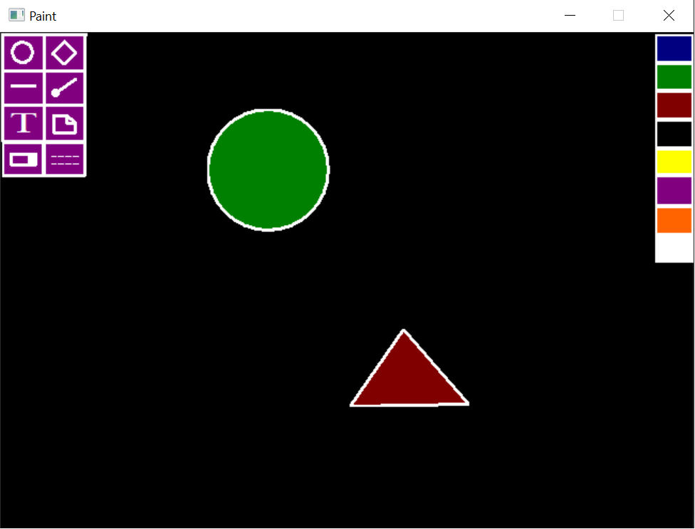

# TextEditor

This project has been created on Visual Studio in C++ using Borland Graphics Interface(BGI). BGI is a graphics library which provides several functions which can be used to create graphical applications. This library is used in this project to design a Paint Program in C++.

It's a simple prototype of a paint program  made from scratch in C++, which implements all the basic features you expect in a minimal paint application. The paint is functional, you can draw shapes such as circle, triangle, rectangle etc., draw plain or dotted line, write text, erase, and fill color. 
The GUI looks as follows.

The paint program uses BGI library as graphics controller, so it is needed for compiling. But you do not have to install the bgi files explicitly as I have included all the dependent files from the library. You can run the project by simply opening ``bgi.sln`` file in Visual Studio and then executing the ``Paint.cpp`` file. 

For more information on BGI, please refer to https://home.cs.colorado.edu/~main/cs1300/doc/bgi/bgi.html
